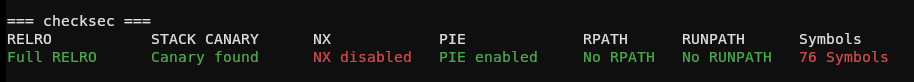
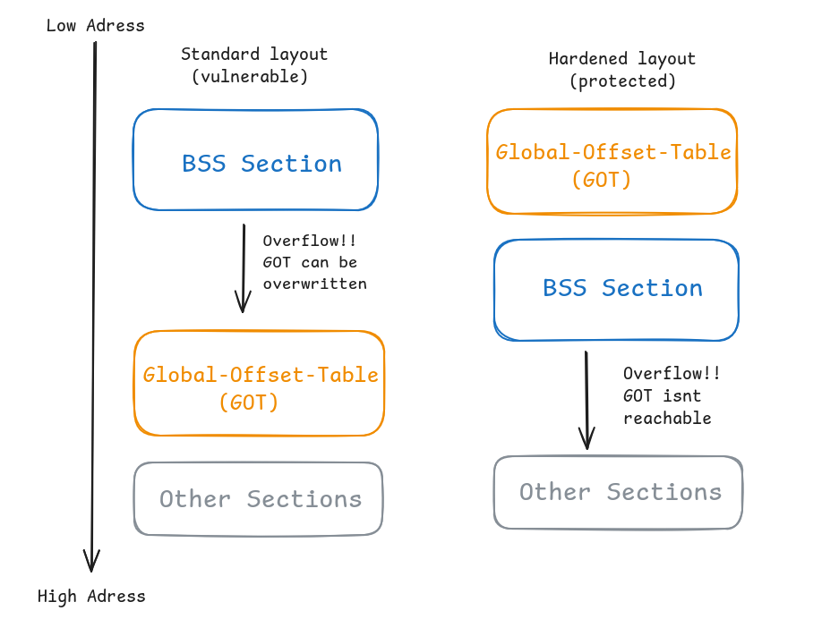

While doing a CTF today, I used my tool [tio](https://github.com/ml0w6c65766c/tio) as usual to check the binary's security mechanisms, and I thought I’d take a moment to write a small series of articles explaining what these mechanisms are, what they do, and how they can theoretically be bypassed.

(checksec output from the CTF I participated in)

As you can see, checksec shows 5 key security mechanisms:

-  **RELRO**
- **STACK CANARY**
- **NX**
- **PIE**
- **RPATH/RUNPATH**

(there are more, but these are the 5 most important ones I will discuss in this article.)

I will cover each of them in separate articles, this one focuses on **RELRO**.

## RELRO

RELRO is short for Relocation Read-Only and it's a security mechanism for compiled ELF-Binarys.
As we can see in our checksec example, Full RELRO is enabled for this binary. However, there are two types of RELRO: Partial RELRO and Full RELRO. Both of them reorder the GOT and BSS from the ELF file.They place the GOT section before the BSS section, so the GOT is located at a lower address than the BSS. This makes it impossible to overwrite the GOT via an overflow, since memory is always overwritten from the lower address to the higher address. 

On the left is the standard layout without RELRO. Here you can see that if, for example, a buffer in the BSS section is overwritten, the GOT can be overwritten as well, since the data is always written from the low address to the high address.
On the right side, you can see the hardened layout with RELRO. Because of RELRO, the GOT is now located below the BSS section, if a buffer is overwritten there, the GOT cannot be overwritten because it is located below the BSS section.

The problem with partial RELRO is that, although the GOT is rearranged, it remains writable. Full RELRO changes this by setting the GOT to read-only after it is loaded.

**So, to summarize**:

| Partial RELRO                    | Full RELRO                       |
| -------------------------------- | -------------------------------- |
| GOT placed before BSS            | GOT placed before BSS            |
| BSS overflow can't overwrite GOT | BSS overflow can't overwrite GOT |
| GOT still writeable at runtime   | GOT marked read-only after load  |

Note: GCC compiles binaries with Partial RELRO by default.

### RELRO Bypass

Yes, it is possible to bypass RELRO. With Full RELRO, it is not possible to overwrite the GOT, so attackers usually resort to other targets.
But Partial RELRO is bypassable, since the GOT is still writable. One bypass method is, for example, a format string bug. This works because the format string is not bound by the low-to-high rule, in other words, the format string bug effectively ignores RELRO reordering.
Therefore, with `%n` you can directly overwrite a GOT entry. For example, if you overwrite the GOT entry of `printf()` with the address of `system()`, the next time the program calls `printf()`, it will execute `system()` instead.

Author: ml0w6c65766c

